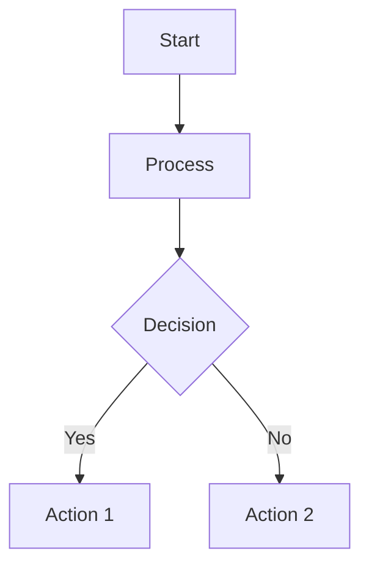

# Upstream Analysis System Documentation

Comprehensive documentation and training materials for the upstream analysis workflow, built with [Docusaurus](https://docusaurus.io/).

## 🌟 Features

### 📚 **Comprehensive Documentation**
- **Getting Started Guide** - Complete setup and onboarding
- **User Documentation** - Detailed usage guides for all components
- **System Architecture** - Technical deep dives and design decisions
- **Workflows** - Step-by-step process documentation
- **Administration** - Configuration and maintenance guides

### 🎓 **Interactive Training**
- **Quick Start Tutorial** - 30-minute hands-on introduction
- **Role-Based Training** - Specialized paths for analysts, developers, and leads
- **Hands-On Exercises** - Practice scenarios with real data
- **Best Practices** - Expert guidance and proven techniques
- **Assessment Tools** - Knowledge checks and certification

### 📖 **Reference Materials**
- **API Documentation** - Complete technical reference
- **Configuration Guides** - All available settings and options
- **Templates** - Ready-to-use templates for analysis and extraction
- **CLI Tools** - Command-line utilities and scripts
- **Troubleshooting** - Common issues and solutions
- **FAQ** - Frequently asked questions

### 🎨 **Modern Documentation Experience**
- **Responsive Design** - Optimized for all device sizes
- **Dark/Light Mode** - User preference support
- **Search Functionality** - Fast, comprehensive search
- **Interactive Diagrams** - Mermaid.js system diagrams
- **Code Highlighting** - Syntax highlighting for multiple languages
- **Mobile Optimized** - Full functionality on mobile devices

## 🚀 Quick Start

### Prerequisites
- **Node.js 18+**
- **npm or yarn**

### Development Setup
```bash
# Clone and navigate
git clone https://github.com/MementoRC/code-graph-rag.git
cd code-graph-rag/docs

# Install dependencies
npm install

# Start development server
npm start
```

Visit `http://localhost:3000` to see the documentation.

### Building for Production
```bash
# Build static site
npm run build

# Serve built site locally
npm run serve
```

## 📁 Project Structure

```
docs/
├── docs/                          # Main documentation content
│   ├── intro.md                   # Documentation homepage
│   ├── getting-started/           # Setup and onboarding guides
│   ├── user-guide/               # User documentation
│   ├── architecture/             # System architecture docs
│   ├── workflows/                # Process documentation
│   └── admin/                    # Administration guides
├── training/                      # Training materials
│   ├── quick-start/              # 30-minute tutorial
│   ├── roles/                    # Role-based training
│   ├── exercises/                # Hands-on exercises
│   ├── best-practices/           # Expert guidance
│   └── assessment/               # Knowledge evaluation
├── reference/                     # Reference materials
│   ├── api/                      # API documentation
│   ├── config/                   # Configuration reference
│   ├── templates/                # Document templates
│   ├── cli/                      # CLI tool documentation
│   ├── troubleshooting/          # Problem solving
│   └── faq/                      # Frequently asked questions
├── blog/                         # Updates and announcements
├── src/                          # React components and pages
│   ├── components/               # Reusable components
│   ├── pages/                    # Custom pages
│   └── css/                      # Custom styles
├── static/                       # Static assets
│   ├── img/                      # Images and icons
│   └── diagrams/                 # Generated diagrams
├── docusaurus.config.js          # Docusaurus configuration
├── sidebars.js                   # Sidebar configuration
└── package.json                  # Dependencies and scripts
```

## 🛠️ Development

### Available Scripts

```bash
# Development
npm start                         # Start dev server with hot reload
npm run dev                       # Start with diagram generation

# Building
npm run build                     # Build for production
npm run serve                     # Serve built site locally

# Quality Assurance
npm run typecheck                 # TypeScript type checking
npm run lint                      # ESLint code quality
npm run format                    # Prettier code formatting

# Content Generation
npm run build-diagrams            # Generate Mermaid diagrams
npm run write-translations        # Extract translatable strings
npm run write-heading-ids         # Generate heading IDs
```

### Adding Content

#### New Documentation Page
```bash
# Create new doc
touch docs/new-section/new-page.md

# Add to sidebar (sidebars.js)
# Add frontmatter and content
```

#### New Training Material
```bash
# Create training content
touch training/new-topic/overview.md

# Update sidebar configuration
# Link from appropriate sections
```

#### New Reference Material
```bash
# Create reference doc
touch reference/new-category/new-reference.md

# Include in reference sidebar
# Add cross-references
```

### Creating Diagrams

Use Mermaid syntax for diagrams:

```markdown

\```
```

### Adding Interactive Elements

Use Docusaurus features:

```markdown
:::tip Pro Tip
This is a helpful tip for users.
:::

:::warning Important
This is an important warning.
:::

:::info Context
Additional context information.
:::

<details>
<summary>Click to expand</summary>

Hidden content that users can reveal.

</details>
```

## 🎨 Customization

### Theming

Edit `src/css/custom.css` to customize:
- Colors and branding
- Typography and spacing
- Component styles
- Dark mode variants

### Configuration

Modify `docusaurus.config.js` for:
- Site metadata
- Navigation structure
- Plugin configuration
- Deployment settings

### Components

Create custom React components in `src/components/`:
- Interactive tutorials
- Custom documentation widgets
- Specialized layouts
- Integration components

## 📊 Analytics and Monitoring

### Built-in Analytics
- **Google Analytics** - Configured in `docusaurus.config.js`
- **Search Analytics** - Algolia search metrics
- **Performance Metrics** - Lighthouse scores

### Content Analytics
- **Page popularity** - Most visited documentation
- **Search queries** - What users are looking for
- **User flows** - Common navigation patterns

## 🔍 Search Configuration

### Algolia DocSearch
Configure in `docusaurus.config.js`:
```javascript
algolia: {
  appId: 'YOUR_APP_ID',
  apiKey: 'YOUR_SEARCH_API_KEY',
  indexName: 'upstream-analysis',
  contextualSearch: true,
}
```

### Local Search
For development or private deployments:
```bash
npm install @docusaurus/plugin-search-local
```

## 🚀 Deployment

### GitHub Pages (Automatic)
Documentation deploys automatically via GitHub Actions:

**Triggers:**
- Push to main branch (docs changes)
- Manual workflow dispatch
- Pull request (build check only)

**Process:**
1. Install dependencies
2. Run quality checks (TypeScript, ESLint)
3. Generate diagrams
4. Build static site
5. Deploy to GitHub Pages

### Manual Deployment
```bash
# Build and deploy
npm run build
npm run deploy
```

### Custom Hosting
```bash
# Build for custom hosting
npm run build

# Upload contents of build/ directory
# to your hosting provider
```

## 🧪 Testing

### Content Testing
```bash
# Check for broken links
npm run build 2>&1 | grep -i "broken"

# Validate markup
npm run build 2>&1 | grep -i "error"

# Test search functionality
# Use browser dev tools on built site
```

### Accessibility Testing
- **WAVE** - Web accessibility evaluation
- **Lighthouse** - Automated accessibility audits
- **Screen Reader** - Manual testing with assistive technology

### Performance Testing
```bash
# Build and analyze bundle
npm run build
npx serve build
# Use Lighthouse or WebPageTest
```

## 🤝 Contributing

### Content Guidelines
- **Clear and Concise** - Use simple, direct language
- **Consistent Structure** - Follow established patterns
- **Visual Elements** - Include diagrams and screenshots
- **Interactive Examples** - Provide hands-on experiences
- **Cross-References** - Link related content

### Review Process
1. **Content Review** - Accuracy and completeness
2. **Technical Review** - Code examples and references
3. **Editorial Review** - Language and style
4. **User Testing** - Usability and clarity

### Style Guide
- **Headings** - Use sentence case
- **Code** - Include language identifiers
- **Links** - Descriptive link text
- **Images** - Alt text for accessibility
- **Lists** - Parallel structure

## 📚 Resources

### Docusaurus Documentation
- **[Official Docs](https://docusaurus.io/docs)** - Complete Docusaurus guide
- **[API Reference](https://docusaurus.io/docs/api)** - Configuration options
- **[Plugin Ecosystem](https://docusaurus.io/community/resources)** - Available plugins

### Content Creation
- **[Markdown Guide](https://www.markdownguide.org/)** - Markdown syntax
- **[Mermaid Docs](https://mermaid-js.github.io/mermaid/)** - Diagram syntax
- **[MDX Documentation](https://mdxjs.com/)** - React in Markdown

### Design Resources
- **[Docusaurus Showcase](https://docusaurus.io/showcase)** - Inspiration
- **[Infima Docs](https://infima.dev/)** - CSS framework
- **[React Documentation](https://react.dev/)** - Component development

## 🆘 Troubleshooting

### Common Issues

**Build fails with "Module not found":**
```bash
# Clear cache and reinstall
rm -rf node_modules package-lock.json
npm install
```

**Diagrams not generating:**
```bash
# Install Mermaid CLI globally
npm install -g @mermaid-js/mermaid-cli

# Or use npx
npx @mermaid-js/mermaid-cli --help
```

**Search not working:**
```bash
# Check Algolia configuration
# Verify index exists
# Test API key permissions
```

**Deployment fails:**
```bash
# Check GitHub Pages settings
# Verify workflow permissions
# Review action logs
```

### Getting Help
- **[GitHub Issues](https://github.com/MementoRC/code-graph-rag/issues)** - Bug reports
- **[Discussions](https://github.com/MementoRC/code-graph-rag/discussions)** - Questions
- **[Docusaurus Discord](https://discord.gg/docusaurus)** - Community support

## 📜 License

This documentation is licensed under the MIT License - see the [LICENSE](../LICENSE) file for details.

## 🙋‍♂️ Support

For questions, issues, or contributions:

1. **Documentation Issues**: [Create an issue](https://github.com/MementoRC/code-graph-rag/issues/new?template=docs-issue.md)
2. **Content Suggestions**: [Start a discussion](https://github.com/MementoRC/code-graph-rag/discussions/new?category=documentation)
3. **Training Feedback**: [Submit feedback](https://github.com/MementoRC/code-graph-rag/discussions/new?category=training)

---

**Built with ❤️ by the Upstream Analysis Team using [Docusaurus](https://docusaurus.io/)**