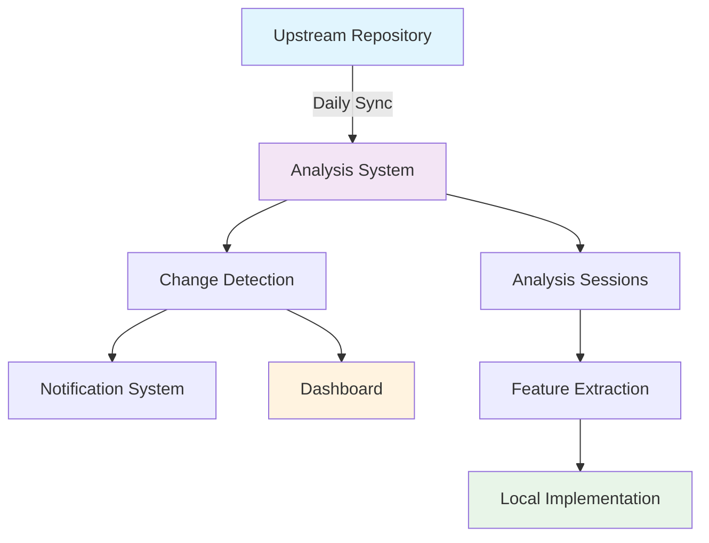

# Getting Started Overview

Welcome to the Upstream Analysis System! This guide will help you understand the system's core concepts and get you ready to start your journey.

## 🎯 What You'll Learn

By the end of this getting started section, you'll:

- Understand the core concepts of upstream analysis
- Have the system installed and configured
- Complete your first analysis session
- Know how to navigate the dashboard
- Be ready for advanced workflows

## 🏗️ System Overview

The Upstream Analysis System consists of several interconnected components:

### Core Components

#### 🔄 **Automated Sync**
- Daily synchronization with upstream repositories
- Intelligent change detection and categorization
- Automatic notification generation

#### 📊 **Analysis Dashboard**
- Real-time visualization of upstream activity
- Team metrics and progress tracking
- Interactive charts and reports

#### 👥 **Analysis Sessions**
- Structured team analysis meetings
- Decision framework for extraction evaluation
- Collaborative documentation and action planning

#### 🚀 **Feature Extraction**
- Automated branch creation for extracted features
- Testing scaffolding and implementation guidance
- Complete traceability and audit trails

## 🎪 Key Concepts

### Upstream Analysis
The systematic process of:
1. **Monitoring** upstream repositories for changes
2. **Analyzing** changes for relevance and value
3. **Deciding** which features to extract
4. **Implementing** extracted features in your codebase

### Analysis Sessions
Structured team meetings where you:
- Review recent upstream changes
- Evaluate extraction candidates
- Make implementation decisions
- Plan next steps and assignments

### Feature Extraction
The process of:
- Creating dedicated branches for features
- Adapting upstream code to your codebase
- Testing and validating implementations
- Maintaining traceability to upstream sources

### Change Classification
Automated categorization of upstream changes:
- **Features**: New functionality additions
- **Bug Fixes**: Error corrections and improvements
- **Security**: Security-related updates
- **Performance**: Optimization improvements
- **Documentation**: Documentation updates
- **Refactoring**: Code structure improvements

## 🚦 Prerequisites Check

Before proceeding, ensure you have:

- [ ] **GitHub Access**: Admin access to your repository
- [ ] **Node.js 18+**: For running automation scripts
- [ ] **Git 2.40+**: For repository operations
- [ ] **Team Alignment**: Agreement on analysis process
- [ ] **Upstream Repository**: Identified upstream source to track

## 📈 Success Metrics

You'll know you're successful when:

- **Daily syncs** run automatically without intervention
- **Team sessions** follow structured templates
- **Extraction decisions** are documented and traceable
- **Implementation time** decreases through systematic approaches
- **Code quality** improves through selective upstream adoption

## 🗺️ Learning Path

Follow this recommended sequence:

### Week 1: Foundation
1. **[Prerequisites](prerequisites)** - Set up your environment
2. **[Installation](installation)** - Install and configure components
3. **[First Steps](first-steps)** - Complete initial setup

### Week 2: Core Usage
4. **[Dashboard Guide](../user-guide/dashboard)** - Master the visualization tools
5. **[Analysis Sessions](../user-guide/analysis-sessions)** - Conduct effective sessions
6. **[Feature Extraction](../user-guide/feature-extraction)** - Extract your first feature

### Week 3: Advanced Workflows
7. **[Automation](../workflows/automation)** - Set up advanced automations
8. **[Team Collaboration](../training/best-practices/team-collaboration)** - Optimize team processes
9. **[Custom Configuration](../admin/configuration)** - Tailor to your needs

## 🎯 Roles and Responsibilities

Understanding who does what:

### 📊 **Analysts**
- Lead analysis sessions
- Evaluate extraction candidates
- Document decisions and rationale

### ⚙️ **Developers**
- Implement extracted features
- Maintain code quality standards
- Handle technical integration challenges

### 👑 **Team Leads**
- Coordinate team activities
- Make strategic extraction decisions
- Monitor process effectiveness

### 🛠️ **Administrators**
- Maintain system configuration
- Monitor system health
- Handle troubleshooting and support

## 🚨 Common Pitfalls

Avoid these common mistakes:

❌ **Skipping Prerequisites** - Leads to setup issues later
❌ **No Team Alignment** - Creates process confusion
❌ **Irregular Sessions** - Reduces system effectiveness
❌ **Poor Documentation** - Makes decisions hard to trace
❌ **Ignoring Quality Gates** - Compromises code integrity

## 📚 Additional Resources

- **[Video Tutorials](#)** - Visual learning materials
- **[Community Forum](#)** - Connect with other users
- **[GitHub Repository](https://github.com/MementoRC/code-graph-rag)** - Source code and issues
- **[Training Materials](/training/quick-start/overview)** - Hands-on exercises

## 🆘 Getting Help

If you encounter issues:

1. **Check Prerequisites** - Ensure all requirements are met
2. **Review Documentation** - Look for relevant guides
3. **Search Issues** - Check if others had similar problems
4. **Ask the Community** - Use GitHub Discussions
5. **Contact Support** - For enterprise users

## ⏭️ Next Steps

Ready to continue? Your next step is:

**[📋 Prerequisites](prerequisites)** - Let's make sure your environment is ready!

---

:::tip Pro Tip
The key to success with upstream analysis is consistency. Regular, structured analysis sessions with good documentation will yield much better results than sporadic, ad-hoc reviews.
:::

:::info Time Investment
Expect to invest **2-4 hours per week** initially as you learn the system. Once established, most teams spend **1-2 hours per week** on analysis activities.
:::