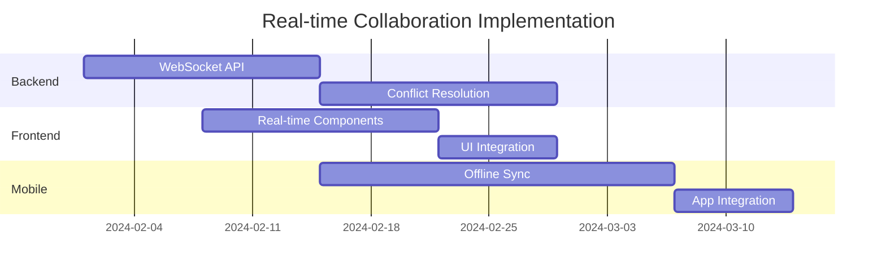

# Hands-On Analysis Practice Exercises

This collection of practical exercises will help you develop and refine your upstream analysis skills through realistic scenarios and hands-on practice.

## 🎯 Exercise Overview

These exercises are designed to simulate real-world upstream analysis situations across different complexity levels:

- **Beginner**: Simple feature extraction decisions
- **Intermediate**: Complex integration scenarios  
- **Advanced**: Strategic architectural decisions
- **Expert**: Multi-team coordination challenges

## 📋 Exercise Instructions

### How to Use These Exercises

1. **Individual Practice**: Work through exercises alone to develop skills
2. **Team Training**: Use in group sessions to practice collaboration
3. **Assessment**: Use as evaluation tools for certification
4. **Onboarding**: Help new team members learn the process

### Exercise Format

Each exercise includes:
- **Scenario Description**: Context and background
- **Upstream Changes**: Actual or realistic code changes
- **Your Task**: What you need to analyze and decide
- **Success Criteria**: How to evaluate your analysis
- **Sample Solution**: Expert analysis for comparison

---

## 🟢 Beginner Exercises

### Exercise B1: Simple Bug Fix Analysis

**Scenario**: You're analyzing changes from the React repository. Your team maintains a customer dashboard built with React 18.

**Upstream Change**:
```javascript
// Commit: Fix memory leak in useEffect cleanup
// Files changed: 1
// Lines added: 3, deleted: 1

// Before:
useEffect(() => {
  const subscription = api.subscribe(callback);
  return subscription.unsubscribe;
}, []);

// After:
useEffect(() => {
  const subscription = api.subscribe(callback);
  return () => subscription.unsubscribe();
}, []);
```

**Context**:
- Your dashboard uses similar subscription patterns in 12 components
- You've had reports of slow performance after long usage sessions
- The fix is in React 18.2.1, you're currently on React 18.1.0

**Your Task**:
1. Apply the decision framework to evaluate this change
2. Make an extraction decision with rationale
3. If extracting, outline implementation approach

**Success Criteria**:
- [ ] Correctly identified the problem being solved
- [ ] Applied decision framework systematically  
- [ ] Made appropriate extraction decision
- [ ] Provided clear rationale
- [ ] Outlined realistic implementation plan

<details>
<summary>📝 Sample Solution</summary>

**Value Assessment (4.25/5 average)**:
- Strategic Alignment: 4/5 (Supports performance and reliability goals)
- Problem Resolution: 5/5 (Directly addresses memory leak issues)
- User Impact: 4/5 (Improves performance, prevents crashes)
- Technical Merit: 4/5 (Clean, minimal fix)

**Effort Assessment (2/5 average)**:
- Implementation: 1/5 (Very simple change)
- Testing: 2/5 (Need to verify no regressions)
- Integration: 2/5 (React version upgrade required)
- Maintenance: 3/5 (Need to apply pattern across components)

**Decision: EXTRACT** (Value 4.25 > Effort 2.0)

**Rationale**: This is a high-value, low-effort fix that directly addresses performance issues reported by users. The memory leak fix should be applied to prevent degraded user experience.

**Implementation Plan**:
1. Upgrade React to 18.2.1
2. Audit all 12 components using subscription patterns
3. Apply the fix consistently across all usage
4. Test for performance improvements and regressions
5. Monitor production metrics after deployment

</details>

### Exercise B2: Documentation Enhancement

**Scenario**: Your team maintains an API client library. The upstream library added comprehensive JSDoc comments and TypeScript definitions.

**Upstream Change**:
```typescript
// Commit: Add comprehensive TypeScript definitions and JSDoc
// Files changed: 15
// Lines added: 247, deleted: 12

// Before:
export function createClient(config) {
  return new ApiClient(config);
}

// After:
/**
 * Creates a new API client instance with the provided configuration
 * @param config - Client configuration options
 * @param config.baseUrl - Base URL for API requests
 * @param config.apiKey - Authentication API key
 * @param config.timeout - Request timeout in milliseconds (default: 5000)
 * @returns Configured API client instance
 * @example
 * ```typescript
 * const client = createClient({
 *   baseUrl: 'https://api.example.com',
 *   apiKey: 'your-api-key',
 *   timeout: 10000
 * });
 * ```
 */
export function createClient(config: ClientConfig): ApiClient {
  return new ApiClient(config);
}

export interface ClientConfig {
  baseUrl: string;
  apiKey: string;
  timeout?: number;
}
```

**Context**:
- Your team frequently gets questions about API usage
- Developer onboarding takes longer due to unclear API documentation
- You're planning to migrate to TypeScript in the next quarter

**Your Task**: Analyze this change and make an extraction decision.

<details>
<summary>📝 Sample Solution</summary>

**Value Assessment (4/5 average)**:
- Strategic Alignment: 5/5 (Supports TypeScript migration and developer experience)
- Problem Resolution: 4/5 (Addresses documentation and onboarding issues)
- User Impact: 3/5 (Improves developer experience, not end-user facing)
- Technical Merit: 4/5 (Industry standard practices)

**Effort Assessment (2.75/5 average)**:
- Implementation: 2/5 (Straightforward documentation addition)
- Testing: 2/5 (Need to verify examples work)
- Integration: 3/5 (TypeScript setup if not already configured)
- Maintenance: 4/5 (Need to maintain documentation accuracy)

**Decision: EXTRACT** (Value 4.0 > Effort 2.75)

**Rationale**: High value for developer productivity and TypeScript migration preparation. Moderate effort but significant long-term benefits for team efficiency and code quality.

</details>

---

## 🟡 Intermediate Exercises

### Exercise I1: Performance Optimization Trade-offs

**Scenario**: Your e-commerce platform serves 100K+ daily users. The upstream framework introduced a new caching mechanism that improves performance but changes API behavior.

**Upstream Change**:
```javascript
// Commit: Add intelligent query caching with cache invalidation
// Files changed: 8
// Lines added: 156, deleted: 23

// New caching behavior:
class QueryCache {
  constructor(options = {}) {
    this.ttl = options.ttl || 300000; // 5 minutes default
    this.maxSize = options.maxSize || 100;
    this.cache = new Map();
  }

  get(query) {
    const cached = this.cache.get(query.hash);
    if (cached && Date.now() - cached.timestamp < this.ttl) {
      return cached.data;
    }
    return null;
  }

  set(query, data) {
    if (this.cache.size >= this.maxSize) {
      const firstKey = this.cache.keys().next().value;
      this.cache.delete(firstKey);
    }
    this.cache.set(query.hash, {
      data,
      timestamp: Date.now()
    });
  }
}

// Breaking change: Queries now return cached data by default
// Need to explicitly bypass cache for real-time data
const products = await query('products', { bypassCache: true });
```

**Context**:
- Your product listings need real-time inventory updates
- User profile data can be cached for better performance  
- Current response times average 200ms, goal is <100ms
- You have 15 different query types across the application

**Analysis Requirements**:
1. Evaluate performance benefits vs. data freshness trade-offs
2. Assess implementation complexity across different query types
3. Consider rollback strategy if issues arise
4. Plan communication strategy for breaking changes

**Your Task**: Provide a comprehensive analysis and recommendation.

<details>
<summary>📝 Sample Solution</summary>

**Value Assessment (3.75/5 average)**:
- Strategic Alignment: 4/5 (Supports performance goals)
- Problem Resolution: 4/5 (Addresses response time issues)
- User Impact: 4/5 (Better performance, but risk of stale data)
- Technical Merit: 3/5 (Good implementation, but breaking changes)

**Effort Assessment (3.5/5 average)**:
- Implementation: 4/5 (Need to audit all 15 query types)
- Testing: 4/5 (Complex testing for cache behavior and invalidation)
- Integration: 3/5 (Breaking changes require careful rollout)
- Maintenance: 3/5 (Cache invalidation complexity)

**Decision: EXTRACT with Conditions** (Value 3.75 ≈ Effort 3.5)

**Rationale**: Performance benefits are significant, but breaking changes require careful planning. Extract with phased implementation.

**Implementation Strategy**:
1. **Phase 1**: Implement caching for non-critical data (user profiles, settings)
2. **Phase 2**: Add cache bypass for real-time data (inventory, pricing)
3. **Phase 3**: Optimize cache configuration based on usage patterns

**Risk Mitigation**:
- Feature flag for easy rollback
- Comprehensive monitoring of cache hit rates and data freshness
- A/B testing with percentage of users

</details>

### Exercise I2: Security Patch with Dependencies

**Scenario**: A security vulnerability was discovered in the authentication library you use. The patch requires updating several dependencies and changes session handling behavior.

**Upstream Changes**:
```javascript
// Critical Security Update: CVE-2024-XXXX
// Severity: High
// Impact: Session fixation vulnerability

// Files changed: 12
// Dependencies updated: 3 major versions

// Before:
app.use(session({
  secret: process.env.SESSION_SECRET,
  resave: false,
  saveUninitialized: false
}));

// After:
app.use(session({
  secret: process.env.SESSION_SECRET,
  resave: false,
  saveUninitialized: false,
  cookie: {
    secure: true,
    httpOnly: true,
    maxAge: 1800000, // 30 minutes (was unlimited)
    sameSite: 'strict'
  },
  genid: () => crypto.randomUUID() // New secure ID generation
}));

// Breaking changes:
// 1. Sessions now expire after 30 minutes (was unlimited)
// 2. Secure flag requires HTTPS in production
// 3. SameSite strict may break some cross-origin requests
```

**Context**:
- Your application currently allows unlimited session duration
- Some features rely on cross-origin requests from partner sites
- Security team has flagged this CVE as requiring immediate attention
- Customer support reports users prefer "remember me" functionality

**Your Task**: Analyze the security patch and develop implementation strategy.

<details>
<summary>📝 Sample Solution</summary>

**Value Assessment (4.75/5 average)**:
- Strategic Alignment: 5/5 (Critical security requirement)
- Problem Resolution: 5/5 (Fixes known vulnerability)
- User Impact: 4/5 (Security improvement, but UX changes)
- Technical Merit: 5/5 (Industry best practices)

**Effort Assessment (4/5 average)**:
- Implementation: 4/5 (Breaking changes require careful handling)
- Testing: 5/5 (Security testing, cross-origin testing required)
- Integration: 4/5 (Partner integration testing needed)
- Maintenance: 3/5 (Standard security configuration)

**Decision: EXTRACT IMMEDIATELY** (Security override)

**Rationale**: Security vulnerabilities require immediate extraction regardless of effort. High severity CVE cannot be delayed.

**Implementation Plan**:
1. **Immediate**: Deploy security fix to staging
2. **Session Duration**: Implement "remember me" option for extended sessions
3. **Cross-Origin**: Add configuration for trusted partner domains
4. **Communication**: Notify users of security improvements and session changes
5. **Monitoring**: Track authentication errors and user complaints

**Risk Mitigation**:
- Emergency rollback plan prepared
- Customer support briefed on changes
- Partner integrations tested before production
- Gradual rollout starting with internal users

</details>

---

## 🔴 Advanced Exercises

### Exercise A1: Architectural Migration

**Scenario**: The upstream framework is migrating from a monolithic architecture to a micro-frontend approach. This represents a major architectural shift that could benefit your large-scale application.

**Upstream Changes**:
```javascript
// Major architectural change: Micro-frontend support
// Files changed: 47
// Lines added: 1,247, deleted: 389

// New micro-frontend container
class MicrofrontendContainer {
  constructor(config) {
    this.registry = new ComponentRegistry();
    this.loader = new DynamicLoader(config.baseUrl);
    this.eventBus = new EventBus();
  }

  async loadMicrofrontend(name, version = 'latest') {
    const manifest = await this.loader.loadManifest(name, version);
    const component = await this.loader.loadComponent(manifest);
    
    return this.registry.register(name, component, {
      sandbox: true,
      permissions: manifest.permissions,
      eventHandlers: manifest.eventHandlers
    });
  }

  // Breaking changes:
  // 1. Component loading is now asynchronous
  // 2. Global state management changes
  // 3. Routing system completely redesigned
}
```

**Context**:
- Your current application is a large SPA with 50+ components
- 5 different teams contribute to different parts of the application
- Deployment coordination is a major bottleneck
- You're planning a team reorganization around feature ownership

**Analysis Requirements**:
1. Evaluate strategic alignment with organizational goals
2. Assess technical migration complexity and timeline
3. Consider impact on team structure and workflows
4. Develop risk assessment and mitigation strategy
5. Create business case for the architectural change

**Your Task**: Provide a comprehensive strategic analysis.

<details>
<summary>📝 Sample Solution</summary>

**Strategic Assessment**:

**Value Assessment (4.25/5 average)**:
- Strategic Alignment: 5/5 (Perfect fit for team reorganization)
- Problem Resolution: 5/5 (Solves deployment bottleneck)
- User Impact: 3/5 (No direct user benefit, but enables faster feature delivery)
- Technical Merit: 4/5 (Modern architecture, but significant complexity)

**Effort Assessment (4.5/5 average)**:
- Implementation: 5/5 (6-12 month migration project)
- Testing: 5/5 (Complete testing strategy redesign needed)
- Integration: 4/5 (Complex coordination between teams)
- Maintenance: 4/5 (New operational complexity)

**Decision: EXTRACT with Strategic Planning** (Strategic importance overrides effort concerns)

**Rationale**: Despite high implementation effort, the strategic alignment with team reorganization and deployment efficiency goals makes this a critical architectural investment.

**Implementation Strategy (12-month timeline)**:

**Phase 1 (Months 1-3): Foundation**
- Set up micro-frontend infrastructure
- Create proof-of-concept with one small component
- Establish team boundaries and ownership

**Phase 2 (Months 4-8): Core Migration**
- Migrate 3-4 major feature areas to micro-frontends
- Establish CI/CD pipelines for independent deployment
- Train teams on new development workflows

**Phase 3 (Months 9-12): Complete Migration**
- Migrate remaining components
- Optimize performance and bundle sizes
- Establish monitoring and governance

**Risk Mitigation**:
- Maintain parallel development capability
- Gradual user rollout with feature flags
- Extensive automated testing
- Cross-team coordination processes

**Business Case**:
- **Development Velocity**: 40% faster feature delivery
- **Team Autonomy**: Independent deployment capabilities
- **Scalability**: Support for team growth
- **Technical Debt**: Reduced coupling and dependencies

</details>

### Exercise A2: Multi-Repository Coordination

**Scenario**: You're responsible for coordinating upstream analysis across 3 teams working on related repositories. A major feature spanning all three repos has been released upstream.

**Upstream Feature**: Real-time collaboration system
- **Frontend repo**: React components for real-time editing
- **Backend repo**: WebSocket server and conflict resolution
- **Mobile repo**: Mobile app integration and offline sync

**Context**:
- Teams have different release cycles (weekly, bi-weekly, monthly)
- Feature requires coordinated deployment across all three platforms
- Different teams have varying upstream analysis maturity
- Customer has requested this feature for upcoming product launch

**Coordination Challenges**:
1. **Technical Dependencies**: Frontend needs backend WebSocket API, mobile needs offline conflict resolution
2. **Timeline Alignment**: Teams need to coordinate implementation and testing
3. **Resource Allocation**: Some teams have limited availability
4. **Quality Standards**: Different teams have different testing approaches

**Your Task**: Develop a cross-team coordination strategy and implementation plan.

<details>
<summary>📝 Sample Solution</summary>

**Cross-Team Analysis Framework**:

**Team Readiness Assessment**:
- **Frontend Team**: High analysis maturity, weekly releases, available bandwidth
- **Backend Team**: Medium analysis maturity, bi-weekly releases, constrained bandwidth  
- **Mobile Team**: Low analysis maturity, monthly releases, medium bandwidth

**Coordination Strategy**:

**1. Unified Decision Framework**
- Joint analysis session with representatives from all teams
- Shared decision criteria focused on customer value and technical feasibility
- Common risk assessment and mitigation planning

**2. Implementation Sequencing**


**3. Governance Structure**
- **Cross-team Lead**: Coordinate between teams
- **Weekly Sync**: Progress updates and blocker resolution
- **Shared Documentation**: Common understanding of requirements
- **Quality Gates**: Coordinated testing and deployment

**Implementation Plan**:

**Week 1-2: Foundation**
- Joint analysis session and decision documentation
- Backend team starts WebSocket API implementation
- Frontend team begins component design

**Week 3-4: Core Development**
- Backend completes API, starts conflict resolution
- Frontend implements real-time components
- Mobile team starts offline sync work

**Week 5-6: Integration**
- Cross-team integration testing
- Frontend integrates with backend API
- Mobile team integrates offline capabilities

**Week 7-8: Deployment**
- Coordinated deployment across all platforms
- Feature flag rollout for gradual activation
- Post-deployment monitoring and support

**Risk Mitigation**:
- Backend team bandwidth constraints: Prioritize core API over advanced features
- Mobile team analysis maturity: Provide additional mentoring and support
- Integration complexity: Early and frequent integration testing
- Timeline pressure: Plan for minimum viable feature with later enhancements

</details>

---

## 🎯 Assessment Exercises

### Assessment A1: Decision Framework Mastery

**Scenario**: You have 30 minutes to analyze 5 different upstream changes and make extraction decisions. Focus on applying the decision framework consistently and efficiently.

**Changes to Analyze**:

1. **Security patch** for SQL injection vulnerability (1 file, 5 lines)
2. **Performance optimization** reducing memory usage by 25% (3 files, 45 lines)
3. **New UI component** for data visualization (12 files, 234 lines)
4. **Breaking API change** removing deprecated methods (8 files, -187 lines)
5. **Experimental feature** for A/B testing framework (15 files, 456 lines)

**Assessment Criteria**:
- Consistent application of decision framework
- Appropriate consideration of context factors
- Clear rationale for each decision
- Realistic implementation planning
- Time management (6 minutes per change)

### Assessment A2: Stakeholder Communication

**Scenario**: Create a presentation explaining your analysis decisions to different stakeholder groups.

**Requirements**:
- **Executive Summary** (2 minutes): High-level business impact
- **Technical Deep-dive** (5 minutes): Implementation details for developers
- **Risk Assessment** (3 minutes): Potential issues and mitigation

**Assessment Criteria**:
- Appropriate level of detail for each audience
- Clear value proposition and business case
- Comprehensive risk assessment
- Professional presentation skills

---

## 📚 Exercise Resources

### Decision Framework Quick Reference

```
Value Assessment:
□ Strategic Alignment (1-5)
□ Problem Resolution (1-5)  
□ User Impact (1-5)
□ Technical Merit (1-5)

Effort Assessment:
□ Implementation Complexity (1-5)
□ Testing Requirements (1-5)
□ Integration Challenges (1-5)
□ Maintenance Overhead (1-5)

Decision Logic:
• Extract if Value > Effort
• Consider if Value ≈ Effort
• Skip if Value < Effort
• Security/Critical: Extract regardless
```

### Common Patterns Library

**High-Value Indicators**:
- Security vulnerability fixes
- Performance improvements >20%
- User experience enhancements
- Critical bug fixes
- API consistency improvements

**High-Effort Indicators**:
- Breaking changes
- Database schema modifications
- New external dependencies
- Architectural refactoring
- Multi-system coordination

### Practice Templates

**Analysis Template**:
```markdown
# Change Analysis: [Title]

## Context
- Repository: 
- Commit: 
- Impact area:

## Decision Framework
**Value (___/5 average)**:
- Strategic Alignment: ___/5
- Problem Resolution: ___/5
- User Impact: ___/5
- Technical Merit: ___/5

**Effort (___/5 average)**:
- Implementation: ___/5
- Testing: ___/5
- Integration: ___/5
- Maintenance: ___/5

## Decision: [Extract/Consider/Skip]

## Rationale
[Why this decision makes sense]

## Implementation Plan
[If extracting, how will you approach it]
```

---

## 🎓 Completion and Next Steps

### Exercise Completion Tracking

Track your progress through the exercises:

- [ ] Beginner Exercise B1: Simple Bug Fix
- [ ] Beginner Exercise B2: Documentation Enhancement
- [ ] Intermediate Exercise I1: Performance Trade-offs
- [ ] Intermediate Exercise I2: Security Patch
- [ ] Advanced Exercise A1: Architectural Migration
- [ ] Advanced Exercise A2: Multi-Repository Coordination
- [ ] Assessment A1: Decision Framework Mastery
- [ ] Assessment A2: Stakeholder Communication

### Skill Development Path

**After Beginner Exercises**:
- Practice on real upstream changes from your repositories
- Shadow experienced analysts in real sessions
- Focus on consistent application of decision framework

**After Intermediate Exercises**:
- Lead practice analysis sessions with your team
- Take on more complex extraction projects
- Develop specialization in specific types of changes

**After Advanced Exercises**:
- Mentor other team members on analysis skills
- Contribute to process improvements and best practices
- Take on cross-team coordination responsibilities

### Feedback and Improvement

**Self-Assessment Questions**:
1. Are you consistently applying the decision framework?
2. Do your decisions align with business and technical priorities?
3. Are you considering all relevant stakeholders and impacts?
4. Is your analysis efficient and well-documented?

**Peer Review Process**:
1. Share your exercise solutions with experienced analysts
2. Seek feedback on decision quality and rationale
3. Compare your approaches with sample solutions
4. Identify areas for continued development

---

:::tip Practice Tip
"The best way to improve analysis skills is through deliberate practice with realistic scenarios. Don't just read through the exercises - actually work through them and document your thinking."
— Senior Analysis Specialist
:::

:::info Real-World Application
"These exercises simulate real conditions, but every actual upstream analysis will have unique context and constraints. Use these as training, but always adapt to your specific situation."
— Lead Technical Analyst
:::

**Ready for real-world application?** Start with beginner exercises and progress through the complexity levels. Remember, analysis skills develop through practice and experience!