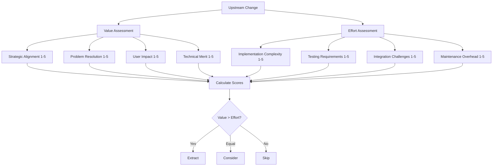

# Analyst Training Path

Welcome to the comprehensive training guide for Upstream Analysis Analysts! This role-specific guide will prepare you to lead effective analysis sessions and make informed decisions about upstream changes.

## 🎯 Learning Objectives

By completing this training, you will be able to:

- ✅ Conduct structured analysis sessions using proven frameworks
- ✅ Evaluate upstream changes for extraction potential
- ✅ Lead collaborative decision-making processes
- ✅ Use analysis tools effectively and efficiently
- ✅ Document analysis results for team transparency
- ✅ Identify patterns and trends in upstream development

## 📋 Prerequisites

Before starting this training path, ensure you have:

- [ ] Completed the [Quick Start Tutorial](../quick-start/overview)
- [ ] Basic understanding of the upstream repository structure
- [ ] Familiarity with Git and GitHub workflows
- [ ] 2-3 hours of dedicated learning time
- [ ] Access to analysis tools and dashboard

## 🚀 Training Modules

### Module 1: Analysis Session Fundamentals (45 minutes)

#### Understanding Your Role

As an Analyst, you are the **decision architect** of the upstream analysis process. Your responsibilities include:

- **Session Planning**: Preparing effective analysis sessions
- **Change Evaluation**: Assessing upstream changes for value and feasibility
- **Team Facilitation**: Leading collaborative decision-making
- **Documentation**: Recording decisions and rationale
- **Pattern Recognition**: Identifying recurring themes and opportunities

#### Core Decision Framework

Master the systematic approach to evaluating changes:

### Module 2: Advanced Analysis Techniques (60 minutes)

#### Change Categorization System

Learn to quickly categorize upstream changes:

- **🆕 Feature Changes**: New functionality, API additions, UI improvements
- **🐛 Bug Fixes**: Security patches, data corruption fixes, performance issues
- **🔧 Technical Improvements**: Refactoring, architecture changes, developer tools
- **📚 Documentation**: README updates, API docs, developer guides

#### Impact Analysis Matrix

| High Value | Medium Value | Low Value |
|------------|--------------|-----------|
| Critical Path | Important | Nice to Have |
| User-Facing | Developer UX | Internal Only |
| Revenue Impact | Cost Savings | Maintenance |
| Security Fix | Performance | Documentation |

### Module 3: Session Leadership Skills (45 minutes)

#### Pre-Session Preparation Checklist

**1 Week Before Session:**
- [ ] Review upcoming upstream changes
- [ ] Pre-categorize obvious decisions
- [ ] Identify complex changes requiring discussion
- [ ] Prepare session agenda and materials

**1 Day Before Session:**
- [ ] Update change analysis with latest commits
- [ ] Review team priorities and current projects
- [ ] Test screen sharing and collaboration tools
- [ ] Send agenda to participants

#### Facilitating Effective Sessions

**Session Structure:**
1. **Opening** (10 min): Welcome, agenda review, ground rules
2. **Change Review** (60-90 min): Structured discussion of changes
3. **Closing** (10 min): Summarize decisions, assign actions

**Best Practices:**
- Keep discussions focused and time-boxed
- Use the decision framework to structure debates
- Document decisions in real-time
- Encourage diverse perspectives

## ✅ Knowledge Assessment

### Self-Assessment Checklist

Rate your confidence level (1-5) in each area:

**Analysis Skills**
- [ ] Using the decision framework effectively ___/5
- [ ] Categorizing changes accurately ___/5
- [ ] Identifying patterns in upstream development ___/5
- [ ] Assessing implementation complexity ___/5

**Leadership Skills**
- [ ] Planning and preparing effective sessions ___/5
- [ ] Facilitating collaborative discussions ___/5
- [ ] Managing time and keeping sessions focused ___/5
- [ ] Handling conflicts and disagreements ___/5

### Certification Requirements

To be certified as an Analyst, you must:

- [ ] Complete all training modules
- [ ] Score 4/5 or higher on self-assessment
- [ ] Successfully facilitate 2 practice sessions
- [ ] Correctly analyze 10 test scenarios
- [ ] Receive peer feedback from 2 experienced team members

## 🚀 Next Steps

After completing this training:

1. **Schedule Practice Sessions**: Arrange 2 practice analysis sessions
2. **Join the Community**: Connect with other analysts in Slack channels
3. **Start Regular Sessions**: Begin conducting weekly upstream analysis
4. **Continuous Learning**: Stay updated with new techniques and tools

---

:::tip Pro Tip
"Don't let perfect be the enemy of good. It's better to make a reversible decision quickly than to spend hours debating."
— Senior Analyst, Platform Team
:::

**Next Reading**: [Developer Training Path](./developer) and [Team Lead Training Path](./team-lead)