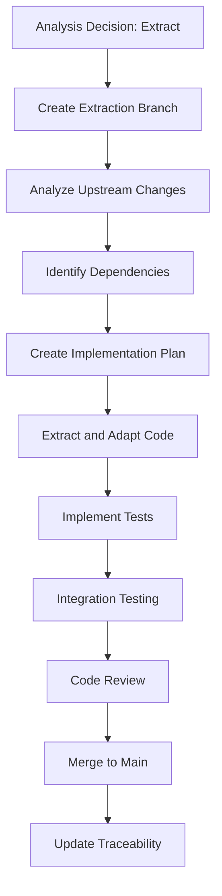

# Developer Training Path

Welcome to the Developer Training Path for the Upstream Analysis System! This guide will prepare you to effectively extract, implement, and integrate valuable features from upstream repositories.

## 🎯 Learning Objectives

By completing this training, you will be able to:

- ✅ Execute feature extraction workflows efficiently
- ✅ Implement upstream changes while maintaining code quality
- ✅ Integrate extracted features with minimal disruption
- ✅ Test and validate extracted features thoroughly
- ✅ Maintain traceability between upstream and local implementations
- ✅ Contribute to analysis sessions with technical insights

## 📋 Prerequisites

Before starting this training path, ensure you have:

- [ ] Completed the [Quick Start Tutorial](../quick-start/overview)
- [ ] Strong proficiency in the relevant programming languages
- [ ] Experience with Git workflows and branching strategies
- [ ] Understanding of testing methodologies
- [ ] Access to development environment and tools
- [ ] 3-4 hours of dedicated learning time

## 🚀 Training Modules

### Module 1: Feature Extraction Fundamentals (60 minutes)

#### Understanding the Extraction Process

As a Developer in the upstream analysis process, you transform analysis decisions into working code. Your role involves:

- **Feature Isolation**: Identifying and extracting specific functionality
- **Adaptation**: Modifying upstream code to fit local architecture
- **Integration**: Seamlessly incorporating changes into existing systems
- **Testing**: Ensuring extracted features work correctly
- **Documentation**: Maintaining implementation records and traceability

#### Extraction Workflow Overview



#### Types of Extractions

**Direct Extraction**
- Copy upstream code with minimal changes
- Best for: Bug fixes, small improvements, utility functions
- Complexity: Low
- Risk: Low

**Adaptive Extraction**
- Modify upstream code to fit local patterns
- Best for: Features that need architectural alignment
- Complexity: Medium
- Risk: Medium

**Inspired Implementation**
- Implement similar functionality using local patterns
- Best for: Major features, architectural changes
- Complexity: High
- Risk: Medium

**Hybrid Approach**
- Combine multiple upstream commits or partial implementations
- Best for: Complex feature sets
- Complexity: Very High
- Risk: High

### Module 2: Technical Implementation Skills (90 minutes)

#### Code Analysis and Dependency Mapping

Before extracting any feature, you need to understand its context:

**Step 1: Commit Analysis**
```bash
# Examine the upstream commit
git show [commit-hash] --stat
git show [commit-hash] --name-only

# Understand file relationships
git show [commit-hash] --pretty=fuller
```

**Step 2: Dependency Identification**
- **Direct Dependencies**: Files directly imported/required
- **Indirect Dependencies**: Functions, classes, or modules used
- **External Dependencies**: Third-party libraries or APIs
- **Configuration Dependencies**: Environment variables, config files

**Step 3: Impact Assessment**
- **Affected Systems**: What parts of your codebase will change?
- **Breaking Changes**: Will this affect existing functionality?
- **Performance Impact**: How will this affect system performance?
- **Security Implications**: Are there any security considerations?

#### Extraction Techniques

**Technique 1: Cherry-Pick with Adaptation**
```bash
# Create extraction branch
git checkout -b feature/extracted-[feature-name]

# Cherry-pick upstream commit
git cherry-pick [upstream-commit-hash]

# Resolve conflicts and adapt code
# Edit files to fit local patterns
git add .
git commit -m "Adapt upstream feature to local architecture"
```

**Technique 2: Manual Implementation**
```bash
# Create extraction branch
git checkout -b feature/extracted-[feature-name]

# Create implementation based on upstream
# Copy relevant code sections
# Adapt to local patterns and standards
git add .
git commit -m "Implement upstream feature: [description]"
```

**Technique 3: Gradual Integration**
```bash
# For complex features, implement in phases
git checkout -b feature/extracted-[feature-name]-phase1

# Implement core functionality
git add .
git commit -m "Phase 1: Core implementation"

# Continue with additional phases
git checkout -b feature/extracted-[feature-name]-phase2
# Implement additional features...
```

#### Code Adaptation Patterns

**Pattern 1: Interface Alignment**
```javascript
// Upstream pattern
function processData(data, options) {
  // upstream implementation
}

// Local pattern adaptation
class DataProcessor {
  process(data, options = {}) {
    // adapted implementation following local patterns
  }
}
```

**Pattern 2: Configuration Integration**
```python
# Upstream configuration
config = {
    'timeout': 30,
    'retries': 3
}

# Local configuration integration
from app.config import settings

config = {
    'timeout': settings.API_TIMEOUT,
    'retries': settings.API_RETRIES
}
```

**Pattern 3: Error Handling Standardization**
```java
// Upstream error handling
try {
    // operation
} catch (Exception e) {
    System.out.println("Error: " + e.getMessage());
}

// Local error handling pattern
try {
    // operation
} catch (Exception e) {
    logger.error("Operation failed", e);
    throw new ServiceException("Operation failed", e);
}
```

### Module 3: Testing and Validation (60 minutes)

#### Testing Strategy for Extracted Features

**Test Categories:**

1. **Unit Tests**: Test individual functions/methods
2. **Integration Tests**: Test feature integration with existing systems
3. **Regression Tests**: Ensure existing functionality isn't broken
4. **Acceptance Tests**: Verify feature meets requirements

#### Test Implementation Approach

**Step 1: Understand Upstream Tests**
```bash
# Examine upstream test files
find upstream-repo -name "*test*" -type f | grep [feature-area]

# Analyze test patterns and coverage
# Identify key test scenarios
```

**Step 2: Adapt Tests to Local Patterns**
```javascript
// Example: Adapting upstream test
// Upstream test pattern
describe('processData', () => {
  it('should process valid data', () => {
    const result = processData(testData);
    expect(result).toBe(expectedResult);
  });
});

// Local test pattern adaptation
describe('DataProcessor', () => {
  let processor;
  
  beforeEach(() => {
    processor = new DataProcessor();
  });
  
  it('should process valid data correctly', () => {
    const result = processor.process(testData);
    expect(result).toEqual(expectedResult);
  });
  
  it('should integrate with existing systems', () => {
    // Additional integration tests
  });
});
```

**Step 3: Create Integration Tests**
```python
# Test integration with existing systems
def test_feature_integration():
    # Setup existing system state
    setup_test_environment()
    
    # Execute extracted feature
    result = extracted_feature.execute(test_input)
    
    # Verify integration points
    assert_system_state_unchanged()
    assert_feature_output_correct(result)
    
    # Cleanup
    cleanup_test_environment()
```

#### Quality Gates

Before merging extracted features, ensure:

- [ ] All unit tests pass
- [ ] Integration tests pass
- [ ] Code coverage meets standards (typically 80%+)
- [ ] No regression test failures
- [ ] Performance benchmarks within acceptable range
- [ ] Security scans show no new vulnerabilities
- [ ] Code review approved by senior developer

### Module 4: Integration and Deployment (45 minutes)

#### Safe Integration Strategies

**Strategy 1: Feature Flags**
```javascript
// Implement with feature flag
function processRequest(request) {
  if (featureFlags.isEnabled('extracted-feature')) {
    return newProcessingMethod(request);
  } else {
    return originalProcessingMethod(request);
  }
}
```

**Strategy 2: Gradual Rollout**
```python
# Implement with percentage rollout
def handle_request(user_id, request):
    if should_use_new_feature(user_id):
        return new_feature_handler(request)
    else:
        return original_handler(request)

def should_use_new_feature(user_id):
    # Roll out to percentage of users
    return hash(user_id) % 100 < ROLLOUT_PERCENTAGE
```

**Strategy 3: Blue-Green Deployment**
```yaml
# Deploy to staging environment first
# Validate functionality
# Switch traffic gradually
# Monitor metrics and rollback if needed
```

#### Monitoring and Observability

**Key Metrics to Track:**
- **Functionality Metrics**: Success rates, error rates, response times
- **Performance Metrics**: CPU usage, memory consumption, database queries
- **Business Metrics**: User engagement, conversion rates, feature adoption
- **System Metrics**: Overall system health and stability

**Implementation Example:**
```python
import logging
import metrics

def extracted_feature_method(input_data):
    start_time = time.time()
    try:
        result = process_data(input_data)
        metrics.increment('extracted_feature.success')
        return result
    except Exception as e:
        metrics.increment('extracted_feature.error')
        logging.error(f"Extracted feature failed: {e}")
        raise
    finally:
        duration = time.time() - start_time
        metrics.timing('extracted_feature.duration', duration)
```

### Module 5: Traceability and Documentation (30 minutes)

#### Maintaining Implementation Records

**Traceability Documentation Template:**
```markdown
# Feature Extraction: [Feature Name]

## Upstream Source
- **Repository**: [upstream-repo-url]
- **Commit Hash**: [commit-hash]
- **Commit Date**: [date]
- **Author**: [author]
- **Upstream PR**: [pr-link]

## Implementation Details
- **Extraction Type**: [Direct/Adaptive/Inspired/Hybrid]
- **Local Branch**: [branch-name]
- **Implementation Date**: [date]
- **Developer**: [your-name]

## Changes Made
- **Files Modified**: [list of files]
- **Key Adaptations**: [description]
- **Dependencies Added**: [list]

## Testing
- **Test Coverage**: [percentage]
- **Test Types**: [unit/integration/regression]
- **Performance Impact**: [metrics]

## Deployment
- **Deployment Strategy**: [feature-flag/gradual/blue-green]
- **Rollout Plan**: [description]
- **Monitoring**: [metrics tracked]

## Future Maintenance
- **Upstream Tracking**: [how to track future changes]
- **Update Strategy**: [how to handle upstream updates]
- **Contact**: [responsible team/person]
```

#### Code Documentation Standards

**Comment Standards for Extracted Code:**
```javascript
/**
 * Extracted from upstream commit: abc123def456
 * Original implementation by: [upstream-author]
 * Adapted for local architecture on: [date]
 * 
 * Key adaptations:
 * - Changed from function to class method
 * - Integrated with local error handling
 * - Added performance monitoring
 */
function extractedFeature(input) {
  // Implementation with clear comments
}
```

## 🛠️ Practical Exercises

### Exercise 1: Simple Feature Extraction (30 minutes)

**Scenario**: Extract a utility function that validates email addresses from upstream.

**Tasks**:
1. Analyze the upstream commit
2. Identify any dependencies
3. Create extraction branch
4. Implement the function with local patterns
5. Write comprehensive tests
6. Create traceability documentation

**Success Criteria**:
- [ ] Function works correctly with local architecture
- [ ] All tests pass
- [ ] Code follows local standards
- [ ] Documentation is complete

### Exercise 2: Complex Integration (60 minutes)

**Scenario**: Extract a caching mechanism that requires database integration.

**Tasks**:
1. Analyze upstream implementation
2. Map dependencies to local equivalents
3. Plan integration strategy
4. Implement with feature flag
5. Create monitoring and alerts
6. Plan rollout strategy

**Success Criteria**:
- [ ] Integration doesn't break existing functionality
- [ ] Performance improves as expected
- [ ] Monitoring shows healthy metrics
- [ ] Rollback plan is prepared

### Exercise 3: Multi-Commit Feature (90 minutes)

**Scenario**: Extract a feature that spans multiple upstream commits.

**Tasks**:
1. Analyze commit sequence
2. Identify logical phases
3. Plan incremental implementation
4. Implement each phase with tests
5. Coordinate with team on integration
6. Document the complete extraction

**Success Criteria**:
- [ ] All phases work correctly
- [ ] Team coordination is effective
- [ ] Documentation covers complete process
- [ ] Future maintenance plan is clear

## ✅ Knowledge Assessment

### Self-Assessment Checklist

Rate your confidence level (1-5) in each area:

**Technical Skills**
- [ ] Analyzing upstream commits effectively ___/5
- [ ] Identifying and mapping dependencies ___/5
- [ ] Adapting code to local patterns ___/5
- [ ] Writing comprehensive tests ___/5

**Integration Skills**
- [ ] Implementing safe integration strategies ___/5
- [ ] Setting up monitoring and alerts ___/5
- [ ] Planning rollout and rollback strategies ___/5
- [ ] Coordinating with team members ___/5

**Documentation Skills**
- [ ] Creating traceability documentation ___/5
- [ ] Writing clear code comments ___/5
- [ ] Maintaining implementation records ___/5
- [ ] Planning future maintenance ___/5

### Practical Assessment

**Scenario-Based Questions**:

1. **Dependency Management**: How would you handle an extracted feature that requires a new third-party library not used in your local codebase?

2. **Performance Impact**: An extracted feature improves functionality but reduces performance by 15%. How do you proceed?

3. **Breaking Changes**: You discover that an extracted feature will break existing API contracts. What's your approach?

4. **Upstream Updates**: Six months after extraction, upstream updates the feature with bug fixes. How do you handle this?

### Certification Requirements

To be certified as a Developer for upstream analysis, you must:

- [ ] Complete all training modules
- [ ] Score 4/5 or higher on self-assessment
- [ ] Successfully complete all 3 practical exercises
- [ ] Extract and integrate 2 real features from upstream
- [ ] Receive code review approval from senior developer
- [ ] Demonstrate knowledge of traceability practices

## 🚀 Advanced Topics

### Handling Complex Scenarios

**Large-Scale Refactoring Extractions**
- Breaking down massive changes into manageable pieces
- Coordinating with multiple team members
- Managing merge conflicts and integration challenges

**Security-Sensitive Extractions**
- Additional validation and testing requirements
- Security review processes
- Compliance considerations

**Performance-Critical Extractions**
- Benchmarking and optimization techniques
- Load testing strategies
- Performance monitoring and alerting

### Automation and Tooling

**Automated Extraction Tools**
- Scripts for common extraction patterns
- Automated testing pipelines
- Integration with CI/CD systems

**Custom Development Tools**
- IDE plugins for upstream analysis
- Code comparison and merging tools
- Automated documentation generation

## 💡 Pro Tips from Expert Developers

:::tip **Start Small**
"Always start with the smallest possible extraction to validate your process. Complex features can be built incrementally."
— Senior Full-Stack Developer
:::

:::tip **Test Everything**
"Upstream tests are valuable, but they don't test integration with your specific architecture. Write integration tests for every extraction."
— Staff Engineer, Backend Team
:::

:::tip **Plan for Updates**
"Think about how you'll handle future upstream updates when you design your extraction. Make it easy to sync changes later."
— Principal Developer, Platform Team
:::

## 🆘 Troubleshooting Guide

### Common Issues and Solutions

**Extraction Branch Conflicts**
- **Problem**: Cherry-pick fails due to conflicts
- **Solution**: Use three-way merge or manual implementation
- **Prevention**: Analyze dependencies before extraction

**Integration Test Failures**
- **Problem**: Feature works in isolation but fails in integration
- **Solution**: Review integration points and data flow
- **Prevention**: Plan integration testing from the beginning

**Performance Regression**
- **Problem**: Extracted feature impacts system performance
- **Solution**: Profile the implementation and optimize bottlenecks
- **Prevention**: Benchmark upstream feature before extraction

**Dependency Conflicts**
- **Problem**: Extracted feature requires conflicting dependencies
- **Solution**: Find compatible versions or alternative implementations
- **Prevention**: Analyze dependency tree during planning

### Getting Help

- **Technical Issues**: #dev-upstream-analysis Slack channel
- **Code Reviews**: Tag @upstream-analysis-reviewers
- **Process Questions**: Consult with team lead or senior developer
- **Tool Problems**: IT Helpdesk or development tools team

## 📈 Career Development

### Growth Opportunities

**Senior Developer Path**:
- Lead complex, multi-system extractions
- Mentor junior developers on extraction techniques
- Develop automation tools and processes
- Drive architectural decisions for upstream integration

**Technical Specialist Path**:
- Deep expertise in specific technology domains
- Advanced optimization and performance tuning
- Research and development of new extraction techniques
- Cross-team consultation on complex integrations

### Success Metrics

Track your development with these metrics:
- **Extraction Success Rate**: Percentage of successful extractions
- **Integration Quality**: Post-deployment issue rate
- **Performance Impact**: Improvements delivered through extractions
- **Team Collaboration**: Contributions to analysis sessions
- **Knowledge Sharing**: Mentoring and documentation contributions

## 🎓 Next Steps

### Immediate Actions (This Week)

1. **Complete Assessment**: Finish self-assessment and identify learning gaps
2. **Practice Extraction**: Work through the practical exercises
3. **Join Community**: Connect with other developers in Slack channels
4. **Schedule Review**: Set up code review process with senior developer

### Short-term Goals (Next Month)

1. **First Real Extraction**: Complete your first production feature extraction
2. **Tool Mastery**: Become proficient with all extraction tools
3. **Process Contribution**: Suggest improvements to extraction workflows
4. **Knowledge Sharing**: Document lessons learned and share with team

### Long-term Development (3-6 Months)

1. **Complex Features**: Take on multi-commit, multi-system extractions
2. **Automation**: Develop tools to streamline common extraction patterns
3. **Mentorship**: Begin helping newer team members learn extraction skills
4. **Innovation**: Research and prototype new extraction techniques

---

**🎉 Congratulations on completing the Developer Training Path!**

You're now equipped with the technical skills and knowledge to effectively extract and integrate upstream features. Remember that mastery comes with practice, so start with simple extractions and gradually take on more complex challenges.

**Next recommended reading**: [Team Lead Training Path](./team-lead) and [Advanced Integration Techniques](../advanced/integration-patterns)