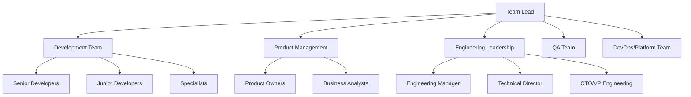
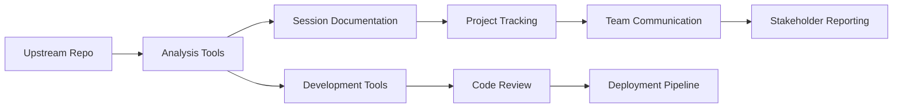
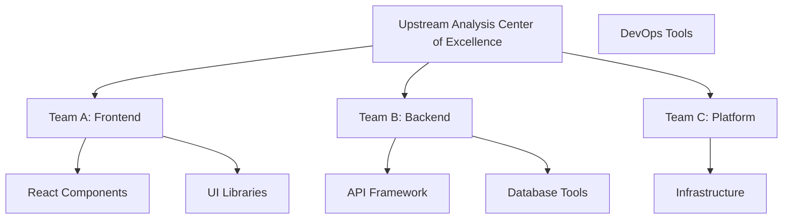

# Team Lead Training Path

Welcome to the Team Lead Training Path for the Upstream Analysis System! This comprehensive guide will prepare you to manage, optimize, and scale the upstream analysis process for your team and organization.

## 🎯 Learning Objectives

By completing this training, you will be able to:

- ✅ Set up and configure upstream analysis workflows for your team
- ✅ Coordinate team activities and optimize process efficiency
- ✅ Manage stakeholder relationships and communication
- ✅ Track metrics, measure success, and drive continuous improvement
- ✅ Scale the process across multiple teams and repositories
- ✅ Lead organizational change and adoption initiatives

## 📋 Prerequisites

Before starting this training path, ensure you have:

- [ ] Completed the [Quick Start Tutorial](../quick-start/overview)
- [ ] Experience managing technical teams (1+ years)
- [ ] Understanding of software development lifecycles
- [ ] Familiarity with project management methodologies
- [ ] Authority to make process decisions for your team
- [ ] 4-5 hours of dedicated learning time

## 🚀 Training Modules

### Module 1: Strategic Foundation and Setup (75 minutes)

#### Understanding Your Role as a Team Lead

As a Team Lead in the upstream analysis process, you are the **process orchestrator** and **strategic enabler**. Your responsibilities span:

- **Process Design**: Establishing workflows that fit your team's needs
- **Team Coordination**: Ensuring effective collaboration and communication
- **Resource Management**: Allocating time, people, and tools efficiently
- **Stakeholder Management**: Managing expectations and reporting progress
- **Continuous Improvement**: Optimizing processes based on metrics and feedback
- **Change Leadership**: Driving adoption and overcoming resistance

#### Initial Team Assessment

Before implementing upstream analysis, evaluate your team's readiness:

**Team Capability Assessment:**
```
Technical Skills (1-5 scale):
- Git/GitHub proficiency: ___
- Code review experience: ___
- Architecture understanding: ___
- Testing/QA capabilities: ___

Process Maturity (1-5 scale):
- Existing code review process: ___
- Documentation practices: ___
- Communication effectiveness: ___
- Change management discipline: ___

Resource Availability:
- Dedicated analysts: ___ people
- Available developers: ___ people
- Weekly time allocation: ___ hours
- Tool budget: $___
```

#### Organizational Context Analysis

**Stakeholder Mapping:**


**Influence and Interest Matrix:**
- **High Influence, High Interest**: Engineering Manager, Senior Developers
- **High Influence, Low Interest**: Technical Director, CTO
- **Low Influence, High Interest**: Junior Developers, QA Team
- **Low Influence, Low Interest**: Business Analysts

#### Implementation Strategy Framework

**Phase 1: Foundation (Weeks 1-4)**
- [ ] Complete team training (Quick Start + Role-specific)
- [ ] Set up tools and infrastructure
- [ ] Define initial process and governance
- [ ] Identify first upstream repository
- [ ] Conduct pilot analysis session

**Phase 2: Optimization (Weeks 5-12)**
- [ ] Refine process based on initial learnings
- [ ] Scale to additional repositories
- [ ] Establish regular cadence and rituals
- [ ] Implement metrics and tracking
- [ ] Build stakeholder reporting

**Phase 3: Maturation (Weeks 13-24)**
- [ ] Optimize based on metrics and feedback
- [ ] Scale to additional teams or departments
- [ ] Develop advanced capabilities
- [ ] Contribute to organizational best practices
- [ ] Plan for long-term sustainability

### Module 2: Process Design and Implementation (90 minutes)

#### Designing Your Team's Workflow

**Core Process Components:**

1. **Analysis Cadence**: How often will you analyze upstream changes?
   - **Weekly**: Best for active upstream repos, high-change teams
   - **Bi-weekly**: Good balance for most teams
   - **Monthly**: Suitable for stable upstreams, lower-priority projects

2. **Session Structure**: How will you conduct analysis sessions?
   - **Duration**: 60-90 minutes typical
   - **Participants**: 3-7 people optimal
   - **Format**: Remote, in-person, or hybrid
   - **Tools**: Collaboration platforms, documentation tools

3. **Decision Authority**: Who makes final extraction decisions?
   - **Consensus**: Team decides together
   - **Lead Analyst**: Designated decision maker
   - **Team Lead**: You make final calls
   - **Hybrid**: Different thresholds for different decision makers

#### Process Configuration Examples

**High-Velocity Team (Daily deployments, microservices)**
```yaml
analysis_cadence: weekly
session_duration: 60_minutes
decision_threshold:
  low_effort: consensus
  medium_effort: lead_analyst
  high_effort: team_lead_approval
automation_level: high
quality_gates: extensive
```

**Stable Platform Team (Monthly releases, monolith)**
```yaml
analysis_cadence: bi_weekly
session_duration: 90_minutes
decision_threshold:
  any_effort: consensus
automation_level: medium
quality_gates: standard
stakeholder_involvement: high
```

**Research Team (Experimental, cutting-edge)**
```yaml
analysis_cadence: weekly
session_duration: 90_minutes
decision_threshold:
  any_effort: consensus
automation_level: low
quality_gates: research_appropriate
documentation_focus: high
```

#### Tool Selection and Configuration

**Essential Tools Checklist:**
- [ ] **Version Control**: Git/GitHub with upstream remotes configured
- [ ] **Collaboration**: Slack, Teams, or equivalent for communication
- [ ] **Documentation**: Confluence, Notion, or wiki for session records
- [ ] **Project Management**: Jira, Linear, or equivalent for tracking
- [ ] **Analysis Tools**: Custom dashboard or upstream analysis tools

**Tool Integration Strategy:**


#### Governance and Guidelines

**Extraction Decision Criteria:**
```
MUST Extract (Automatic approval):
- Security patches (Critical/High severity)
- Performance improvements >20%
- Bug fixes affecting core functionality

SHOULD Extract (Analyst approval):
- Feature improvements with clear user value
- Developer experience enhancements
- Architecture improvements

MAY Extract (Team Lead approval):
- Nice-to-have features
- Experimental functionality  
- Large refactoring efforts

MUST NOT Extract (Automatic rejection):
- Breaking changes without migration path
- Features outside product scope
- Changes requiring >40 hours implementation
```

### Module 3: Team Coordination and Leadership (60 minutes)

#### Building High-Performing Analysis Teams

**Role Assignment Strategy:**

**Lead Analyst (1 person)**
- Experienced developer with strong analytical skills
- Good communication and facilitation abilities
- Deep understanding of your product and architecture
- 20-30% time allocation

**Contributing Developers (2-4 people)**
- Mix of senior and junior developers
- Diverse expertise across your tech stack
- Regular participants in analysis sessions
- 5-10% time allocation each

**Subject Matter Experts (As needed)**
- Security specialist for security-related changes
- Performance engineer for optimization changes
- UX designer for user-facing changes
- Called in for specific analysis sessions

#### Effective Session Management

**Pre-Session Preparation (Team Lead Responsibilities):**
- [ ] Review upcoming changes with Lead Analyst
- [ ] Identify session participants based on change types
- [ ] Prepare session agenda and materials
- [ ] Book appropriate meeting room/virtual space
- [ ] Send calendar invites with prep materials

**During Session Facilitation:**
- **Opening** (5 min): Set context, review agenda, establish ground rules
- **Change Review** (50-80 min): Systematic review using decision framework
- **Decision Recording** (5-10 min): Document all decisions and rationale
- **Action Planning** (5-10 min): Assign extraction tasks and timelines
- **Closing** (5 min): Summarize outcomes, schedule follow-ups

**Post-Session Follow-up:**
- [ ] Share session notes with all participants
- [ ] Update project tracking with extraction tasks
- [ ] Communicate decisions to broader team
- [ ] Schedule check-ins on extraction progress

#### Managing Team Dynamics

**Common Challenges and Solutions:**

**Challenge: Analysis Paralysis**
- Symptoms: Long discussions without decisions, perfectionism
- Solutions: Time-box discussions, use voting mechanisms, "good enough" mindset
- Prevention: Clear decision criteria, experienced facilitator

**Challenge: Technical Bias**
- Symptoms: Decisions based on technical preference vs. business value
- Solutions: Include non-technical perspectives, emphasize user impact
- Prevention: Balanced team composition, clear value criteria

**Challenge: Scope Creep**
- Symptoms: Discussions expanding beyond specific changes
- Solutions: "Parking lot" for off-topic items, strict agenda adherence
- Prevention: Well-prepared sessions, focused facilitation

**Challenge: Low Participation**
- Symptoms: Few people speaking, lack of diverse input
- Solutions: Direct questions to quiet members, anonymous voting
- Prevention: Psychological safety, rotate speaking opportunities

### Module 4: Metrics, Measurement, and Optimization (75 minutes)

#### Key Performance Indicators (KPIs)

**Process Efficiency Metrics:**
- **Analysis Velocity**: Changes analyzed per session
- **Decision Speed**: Average time from change identification to decision
- **Session Effectiveness**: Percentage of sessions resulting in concrete decisions
- **Stakeholder Satisfaction**: Regular feedback scores from participants

**Extraction Success Metrics:**
- **Extraction Success Rate**: Percentage of "extract" decisions successfully implemented
- **Implementation Time**: Average time from decision to production deployment
- **Quality Metrics**: Post-deployment bug rates, performance impact
- **Value Delivered**: Business metrics improvements from extracted features

**Team Development Metrics:**
- **Participation Rates**: Active engagement in sessions
- **Skill Development**: Team members advancing in analysis capabilities
- **Knowledge Sharing**: Documentation created, best practices shared
- **Process Innovation**: Improvements suggested and implemented

#### Measurement Infrastructure

**Data Collection Strategy:**
```python
# Example metrics tracking
class AnalysisMetrics:
    def track_session(self, session_data):
        metrics = {
            'session_id': session_data.id,
            'duration': session_data.duration,
            'participants': len(session_data.participants),
            'changes_analyzed': len(session_data.changes),
            'decisions_made': len(session_data.decisions),
            'extract_decisions': session_data.extract_count,
            'satisfaction_score': session_data.feedback_score
        }
        self.store_metrics(metrics)
    
    def track_extraction(self, extraction_data):
        metrics = {
            'extraction_id': extraction_data.id,
            'decision_date': extraction_data.decided_at,
            'implementation_start': extraction_data.started_at,
            'deployment_date': extraction_data.deployed_at,
            'effort_estimate': extraction_data.estimated_hours,
            'actual_effort': extraction_data.actual_hours,
            'quality_score': extraction_data.quality_metrics
        }
        self.store_metrics(metrics)
```

**Dashboard and Reporting:**
- **Weekly Team Dashboard**: Process metrics, extraction status, upcoming work
- **Monthly Stakeholder Report**: Value delivered, team performance, strategic insights
- **Quarterly Review**: Process optimization, team development, strategic alignment

#### Continuous Improvement Framework

**Monthly Process Review:**
- [ ] Analyze metrics trends and identify issues
- [ ] Collect team feedback on process effectiveness
- [ ] Review recent extraction outcomes and lessons learned
- [ ] Identify specific improvements to implement
- [ ] Update process documentation

**Quarterly Strategic Review:**
- [ ] Assess alignment with business objectives
- [ ] Evaluate team skill development and needs
- [ ] Review tool effectiveness and potential upgrades
- [ ] Plan process evolution for next quarter
- [ ] Update stakeholder communication

**Improvement Implementation Process:**
1. **Identify**: Use metrics and feedback to find improvement opportunities
2. **Hypothesize**: Develop specific improvement hypotheses
3. **Experiment**: Implement small-scale trials of improvements
4. **Measure**: Track impact of changes on key metrics
5. **Adopt**: Scale successful improvements across the team

### Module 5: Stakeholder Management and Communication (45 minutes)

#### Stakeholder Communication Strategy

**Communication Matrix:**
| Stakeholder | Information Needs | Frequency | Format |
|-------------|------------------|-----------|--------|
| Engineering Manager | Process health, team efficiency | Weekly | Dashboard + Brief |
| Product Management | Features extracted, business value | Bi-weekly | Summary Report |
| Development Team | Decisions, extraction tasks | Real-time | Slack + Documentation |
| Senior Leadership | Strategic value, ROI | Monthly | Executive Summary |

#### Value Communication Framework

**For Business Stakeholders:**
- **Feature Value**: "Extracted authentication improvements reduce support tickets by 25%"
- **Risk Mitigation**: "Security patches extracted within 48 hours prevent vulnerabilities"
- **Cost Efficiency**: "Upstream analysis saves 40 hours/month vs. building from scratch"
- **Strategic Advantage**: "Early adoption of performance improvements improves user experience"

**For Technical Stakeholders:**
- **Technical Debt**: "Extracted refactoring reduces complexity by 30%"
- **Developer Productivity**: "New tooling from upstream saves 2 hours/developer/week"
- **Architecture Improvement**: "Extracted patterns improve system maintainability"
- **Quality Enhancement**: "Upstream testing approaches reduce bug rates by 15%"

#### Reporting Templates

**Weekly Team Status:**
```markdown
# Upstream Analysis - Week of [Date]

## 📊 Key Metrics
- Changes Analyzed: [X]
- Extraction Decisions: [Y]
- Completed Implementations: [Z]
- Team Satisfaction: [Score]/5

## ✅ Completed This Week
- [List completed extractions]
- [Process improvements implemented]

## 🚧 In Progress
- [Current extractions with timeline]
- [Team development activities]

## ⚠️ Issues and Blockers
- [Any process or resource issues]
- [Required leadership support]

## 📈 Next Week Focus
- [Planned analysis sessions]
- [Key extractions to complete]
```

**Monthly Executive Summary:**
```markdown
# Upstream Analysis Program - [Month] Report

## 🎯 Strategic Impact
- **Features Delivered**: [X] new capabilities from upstream
- **Business Value**: [Quantified impact on KPIs]
- **Risk Mitigation**: [Security/performance issues addressed]

## 📊 Program Health
- **Team Efficiency**: [Metrics on process effectiveness]
- **Quality Outcomes**: [Post-deployment success rates]
- **Stakeholder Satisfaction**: [Feedback scores]

## 🚀 Success Stories
- [Specific examples of high-value extractions]
- [Process improvements that delivered results]

## 🎯 Next Month Priorities
- [Strategic focus areas]
- [Process enhancements planned]
```

### Module 6: Scaling and Advanced Leadership (60 minutes)

#### Scaling Across Teams and Repositories

**Multi-Team Coordination:**


**Governance at Scale:**
- **Standards Committee**: Define organization-wide standards
- **Knowledge Sharing**: Regular cross-team sharing sessions
- **Tool Standardization**: Common tools and processes
- **Best Practice Repository**: Centralized knowledge base

#### Change Management and Adoption

**Adoption Curve Management:**
- **Early Adopters** (10%): Enthusiastic team members who drive initial success
- **Early Majority** (30%): Pragmatic team members who adopt after seeing benefits
- **Late Majority** (40%): Skeptical team members who need social proof
- **Laggards** (20%): Resistant team members who require extra support

**Overcoming Resistance:**
- **Individual Concerns**: Address through one-on-one conversations
- **Skill Gaps**: Provide targeted training and mentoring
- **Process Conflicts**: Adapt process to fit existing workflows
- **Resource Constraints**: Demonstrate ROI and secure additional resources

#### Advanced Leadership Challenges

**Complex Technical Decisions:**
- Cross-team architectural implications
- Legacy system integration challenges
- Performance and scalability trade-offs
- Security and compliance requirements

**Organizational Politics:**
- Competing priorities with other initiatives
- Resource allocation conflicts
- Stakeholder alignment challenges
- Executive sponsor management

**Strategic Evolution:**
- Adapting to changing business needs
- Technology stack evolution
- Team reorganization impacts
- Market and competitive pressures

## 🛠️ Practical Leadership Scenarios

### Scenario 1: Process Resistance (30 minutes)

**Situation**: Several senior developers are pushing back against the upstream analysis process, claiming it slows down development and adds unnecessary overhead.

**Your Response Plan**:
1. **Listen and Understand**: What are their specific concerns?
2. **Analyze Metrics**: Is the process actually slowing things down?
3. **Adapt Process**: What modifications could address concerns?
4. **Demonstrate Value**: How can you show concrete benefits?
5. **Escalation Strategy**: When might you need leadership support?

### Scenario 2: Resource Constraints (30 minutes)

**Situation**: Your manager wants to reduce the time allocated to upstream analysis by 50% due to competing priorities.

**Your Response Plan**:
1. **Value Proposition**: How do you quantify the ROI of the process?
2. **Efficiency Improvements**: What could you automate or streamline?
3. **Priority Framework**: How would you maintain value with less time?
4. **Risk Assessment**: What risks come with reduced investment?
5. **Alternative Approaches**: What creative solutions could work?

### Scenario 3: Cross-Team Coordination (30 minutes)

**Situation**: Three teams want to extract the same upstream feature, but their implementations would be incompatible.

**Your Response Plan**:
1. **Stakeholder Analysis**: Who are the key decision makers?
2. **Technical Assessment**: What are the technical trade-offs?
3. **Coordination Strategy**: How could teams collaborate?
4. **Governance Framework**: What process prevents future conflicts?
5. **Implementation Plan**: How do you execute the solution?

## ✅ Leadership Assessment

### Self-Assessment Checklist

Rate your confidence level (1-5) in each area:

**Strategic Leadership**
- [ ] Designing effective processes for your team ___/5
- [ ] Aligning upstream analysis with business objectives ___/5
- [ ] Making strategic decisions about resource allocation ___/5
- [ ] Planning for long-term process evolution ___/5

**Team Leadership**
- [ ] Building and developing high-performing teams ___/5
- [ ] Facilitating effective collaboration and decision-making ___/5
- [ ] Managing conflict and resistance to change ___/5
- [ ] Coaching team members on analysis skills ___/5

**Organizational Leadership**
- [ ] Managing stakeholder relationships effectively ___/5
- [ ] Communicating value to business and technical audiences ___/5
- [ ] Driving adoption across multiple teams ___/5
- [ ] Influencing organizational change ___/5

### Leadership Scenarios Assessment

**Scenario-Based Questions**:

1. **Strategic Decision**: Your team has capacity to analyze one of two upstream repositories. One has more frequent updates but lower business impact; the other has fewer updates but higher strategic value. How do you decide?

2. **Resource Allocation**: A major upstream security vulnerability requires immediate extraction, but your team is already committed to a high-priority business feature. How do you handle this conflict?

3. **Process Evolution**: After six months, your metrics show that 60% of extraction decisions are never implemented due to changing priorities. How do you address this?

4. **Organizational Change**: Senior leadership wants to expand upstream analysis to 10 additional teams within three months. How do you plan and execute this expansion?

### Certification Requirements

To be certified as a Team Lead for upstream analysis, you must:

- [ ] Complete all training modules
- [ ] Score 4/5 or higher on self-assessment
- [ ] Successfully implement upstream analysis for your team
- [ ] Demonstrate 3 months of effective process management
- [ ] Show measurable improvements in team performance
- [ ] Receive feedback from team members and stakeholders
- [ ] Present a case study of successful process optimization

## 🚀 Advanced Leadership Development

### Specialization Paths

**Process Innovation Leader**
- Develop new analysis methodologies and tools
- Research and prototype advanced automation
- Contribute to open-source upstream analysis tools
- Speak at conferences and industry events

**Organizational Change Leader**
- Lead large-scale adoption initiatives
- Develop training programs and change management strategies
- Mentor other team leads and process champions
- Drive organization-wide best practices

**Technical Strategy Leader**
- Focus on architectural implications of upstream changes
- Develop frameworks for complex technical decision-making
- Lead cross-organizational technical initiatives
- Bridge business strategy and technical execution

### Leadership Excellence Program

**Months 1-3: Foundation**
- Master the fundamentals of process design and team leadership
- Establish metrics and measurement infrastructure
- Build strong stakeholder relationships
- Demonstrate initial value and team adoption

**Months 4-6: Optimization**
- Drive process improvements based on data and feedback
- Expand influence beyond immediate team
- Develop mentoring and coaching capabilities
- Contribute to organizational knowledge sharing

**Months 7-12: Innovation**
- Lead advanced process innovations
- Drive cross-team or organizational initiatives
- Develop external thought leadership
- Plan for succession and knowledge transfer

## 💡 Leadership Wisdom from Expert Team Leads

:::tip **Start with Why**
"Before implementing any upstream analysis process, make sure your team understands why it matters. The 'what' and 'how' are easier when everyone believes in the 'why'."
— Director of Engineering, SaaS Platform
:::

:::tip **Measure What Matters**
"Don't track metrics just because you can. Focus on the 3-5 metrics that actually drive the behaviors and outcomes you want to see."
— VP of Product Engineering, E-commerce
:::

:::tip **Embrace Imperfection**
"Your process will never be perfect, and that's okay. Focus on continuous improvement rather than upfront perfection. Your team will respect the honesty and adaptability."
— Principal Engineering Manager, FinTech
:::

:::tip **Invest in People**
"The tools and processes matter, but the people matter more. Invest in developing your team's skills and you'll see exponential returns in process effectiveness."
— Head of Engineering, Healthcare Technology
:::

## 🎓 Graduation and Leadership Journey

### Completion Requirements

To graduate from Team Lead training:

1. ✅ Complete all 6 training modules
2. ✅ Pass the leadership assessment
3. ✅ Successfully implement upstream analysis for your team
4. ✅ Demonstrate measurable process improvements
5. ✅ Receive certification from training coordinator
6. ✅ Present lessons learned to other team leads

### Your Leadership Impact Plan

**30-Day Quick Wins:**
- [ ] Complete team assessment and stakeholder mapping
- [ ] Design initial process framework for your team
- [ ] Conduct first analysis session with proper facilitation
- [ ] Establish basic metrics and tracking
- [ ] Communicate early wins to stakeholders

**90-Day Foundation:**
- [ ] Refine process based on initial feedback and metrics
- [ ] Complete team training and role assignments
- [ ] Establish regular cadence and rituals
- [ ] Build stakeholder reporting and communication
- [ ] Document lessons learned and best practices

**One-Year Transformation:**
- [ ] Demonstrate significant value delivery from upstream analysis
- [ ] Achieve high team satisfaction and engagement scores
- [ ] Contribute to organizational best practices and knowledge sharing
- [ ] Mentor other team leads or process champions
- [ ] Plan for continued process evolution and innovation

---

**🎉 Congratulations on completing the Team Lead Training Path!**

You're now equipped with the strategic, tactical, and leadership skills necessary to successfully implement and scale upstream analysis processes. Remember that leadership is a continuous journey of learning, adapting, and growing.

**Your next challenge**: Take everything you've learned and make it work for your unique team, organization, and context. The frameworks and principles are your foundation, but your leadership judgment and adaptability will determine your success.

**Recommended next reading**: [Organizational Scaling Guide](../advanced/scaling-across-teams) and [Executive Communication Toolkit](../reference/executive-reporting)